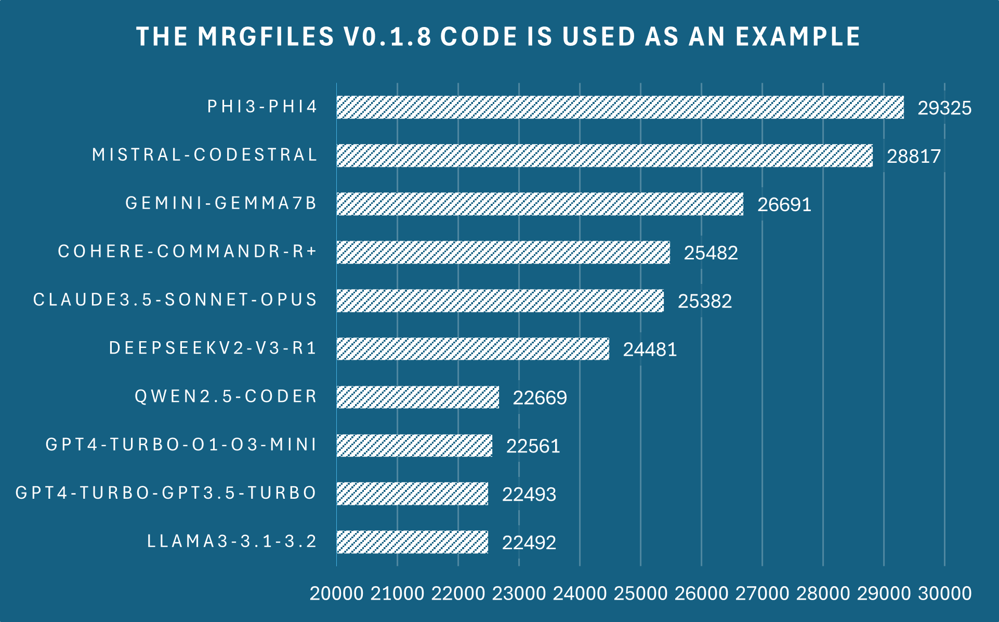

# mrgfile — Project Files Merger for AI Analysis 📄🚀

**mrgfile** is a fast and convenient Rust-powered CLI utility designed to combine project files into a single structured text document. The output is optimized for ingestion by Large Language Models (LLMs) like GPT, Gemini, and Claude for code analysis, refactoring, or bug hunting.

---

## ✨ Features

- 📂 **Interactive Directory Selection**: Automatically detects and prompts you to select project directories and merge files interactively.
- 🌳 **Project Directory Tree**: Prepends a clean, formatted folder structure tree to the output file.
- 🧮 **Token Counting**: Displays real-time, accurate token counts for **GPT-4o**, **Gemini**, and **Claude** models using their official tokenizers (vocabulary files are downloaded and cached automatically on the first run).
- 🧬 **Code Processing Modes**:
  - 📝 **Full** (default): Copies file contents entirely without changes.
  - ⚡ **Minify**: Strips comments and unnecessary whitespace to conserve tokens.
  - 💀 **Maximize**: Extracts structural skeletons (function, class, method, and struct signatures) using `tree-sitter` parsers.
- 🪚 **Automatic Splitting**: Automatically splits the merged output into numbered part files if the token count exceeds a specified threshold.
- 🛡️ **Ignore Custom Patterns**: Uses a `.mrgignore` configuration (similar to `.gitignore`) to filter out binaries, build folders (`target/`, `node_modules/`), secrets, and temporary files.
- 🔑 **Integrity Verification**: Generates a SHA3-256 hash for the merged project content.
- 🔄 **Git Integration**: Automatically updates your local `.gitignore` with the generated merge files and configuration files.

---

## 📥 Installation and Update

### ✅ Install with cargo:
```bash
cargo install --git https://github.com/cyberuser0x33/mrgfile.git
```

### 🔄 Update:
```bash
cargo install --git https://github.com/cyberuser0x33/mrgfile.git --force
```

---

## 🚀 Quick Start

Once installed, the utility is available globally as `mrg`.

1. **Initialize**: Create a default ignore configuration file in your project root:
   ```bash
   mrg init
   ```
2. **Combine**: Merge the files in the current folder (you will be prompted to select a directory interactively):
   ```bash
   mrg combine
   ```
   *Or specify a folder path directly:*
   ```bash
   mrg combine /path/to/project
   ```
3. **View Structure**: Print the directory tree structure contained in an existing merge file:
   ```bash
   mrg structure
   ```

---

## 🛠️ Subcommands

The utility supports the following subcommands:

- 🆕 **`init [NAME]`** — Creates a `.mrgignore` configuration file in the current directory. If `[NAME]` is specified, it will be included in the creation message.
- 🔗 **`combine [DIR]`** — Scans and merges files in the specified directory `[DIR]`. If `[DIR]` is omitted, it triggers an interactive menu to select from available folders.
- 🔄 **`update [DIR]`** — Updates an existing merge file for the specified directory. Overwrites the file without asking for confirmation.
- 🌳 **`structure`** — Extracts and prints the project directory tree from an existing `mrg-*.txt` file.
- 📄 **`file`** — Prints the combined code content from an existing `mrg-*.txt` file (skipping headers and structural diagrams).

---

## ⚙️ Global Flags and Options

You can pass these flags alongside subcommands or use them directly as shortcuts:

### 📌 Command Shortcuts
- `-c, --combine [DIR]` — Shortcut for the `combine` subcommand.
- `-u, --update [DIR]` — Shortcut for the `update` subcommand.
- `-s, --structure` — Shortcut for the `structure` subcommand.
- `-f, --file` — Shortcut for the `file` subcommand.

### 🧬 Processing Mode Settings
- `-p, --pattern` — Interactively prompts you to select a processing pattern (`Full`, `Minify`, or `Maximize`) before merging.
- `--pattern-full` — Forces Full mode (default), copying files completely.
- `--pattern-min` — Forces Minify mode, removing single-line/multi-line comments and unnecessary lines.
- `--pattern-max [FILTERS]...` — Forces Maximize mode to extract only code signatures/skeletons. You can narrow down this mode to specific directories or files using filters:
  - `d="folder_name"` — Applies Maximize mode only to the specified directory.
  - `f="file_name.ext"` — Applies Maximize mode only to the specified file.
  *Example:* `mrg combine --pattern-max d="src" f="main.py"`

### 🪚 Auto-Splitting and Limits
- `--split [LIMIT]` — Enables splitting the output into multiple parts (part1, part2, etc.) if the token count exceeds the limit. Supports formats like:
  - `350K` (350,000 tokens)
  - `1.2M` (1,200,000 tokens)
  - `500000` (raw integer value)
  *(Default is `500K` when split checks trigger)*
- `--notsplit` — Disables splitting checks entirely, writing the entire codebase into a single file (takes precedence over `--split`).
- `-i, --ignore` — Ignores size checks for individual files. By default, `mrg` will ask for confirmation before merging files larger than 100 KB.

---

## 📝 Ignored Files (.mrgignore)

The `.mrgignore` file works exactly like a `.gitignore` file. You can define glob patterns for files and directories that should be skipped during the scanning phase.
Running `mrg init` generates a default config that excludes:
- System and Git folders (`.git`, `.gitignore`, `.mrgignore`, `.github`).
- Sensitive data and credentials (`.env`, `*.pem`, `*.key`, `id_rsa`, `credentials.json`).
- Heavy build targets and packages (`target/`, `node_modules/`, `venv/`, `dist/`, `build/`).
- Compressed files, databases, binaries, logs, and cache (`*.exe`, `*.log`, `*.zip`, `*.db`, `*.png`, `*.pdf`).

---

## 📊 Sample Output

Upon merging a project named `my_project`, a text file `mrg-my_project.txt` will be created with the following layout:

```text
Project merger tool v0.1.7
my_project (23-Jun-2026/03:15:30)
hash(sha3-256):8a6f3b...
**********
Project Structure:
my_project/
├── Cargo.toml
└── src
    ├── main.rs
    └── utils.rs

=== start Cargo.toml ===
[package]
name = "my_project"
version = "0.1.0"
...
=== end Cargo.toml ===

=== start src/main.rs ===
fn main() {
    println!("Hello, World!");
}
=== end src/main.rs ===
```

The terminal prints a corresponding summary:
```text
[+] Created mrg-my_project.txt (15.20 KB)
[*] Files merged: 3
[*] Files ignored: 12
Words: 240, Characters: 1,520
SHA3-256-data: 8a6f3b794d...

Token Statistics (there may be some margin of error): 
GPT4-Turbo-O1-O3-Mini: ~350
Gemini-Gemma7B: ~310
Claude3.5-Sonnet-Opus: ~340
```

---

## 📈 Tokenization Comparison

Below is a diagram comparing tokenization statistics across the different supported models:



---

## 📄 License

Distributed under the [GNU Affero General Public License v3](https://www.gnu.org/licenses/agpl-3.0.html)<br>
See LICENSE.txt file for more details.
